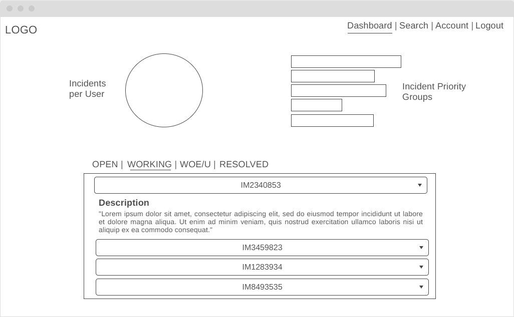
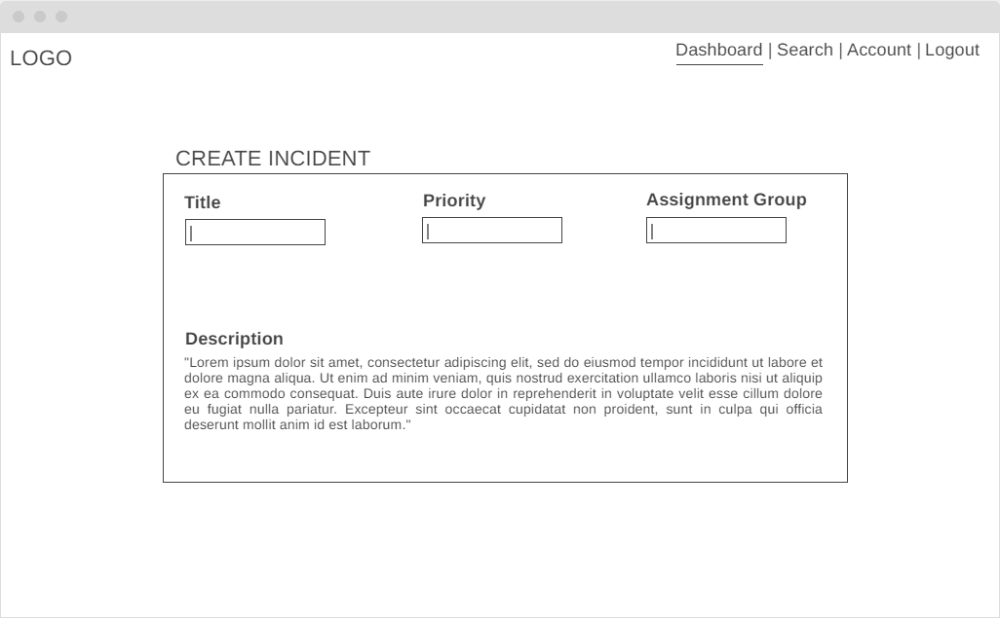

# Bug Tracker
This project is about developing a bug tracker tool for software engineers. The goal is for end users to be able to enter, update and monitor incidents and bugs. A live demo will be hosted on the application platform [Heroku](https://www.heroku.com/).  
The program is created for educational use only and is still under development.

## Technologies
- [Python 3.0](https://www.python.org/)
- [Flask 1.1](https://flask.palletsprojects.com/en/1.1.x/)
- [MongoDB](https://www.mongodb.com/3)
- [CSS3](https://developer.mozilla.org/en-US/docs/Archive/CSS3)

## User Stories
- As a User, I want to be able to register, update and delete my user account.
- As a User, I want the ability to create, update and delete my own incidents.
- As a User, I want to have a dashboard that includes all incidents created by myself and others.
- As a User, I want to have a search function to easily find current and past incidents.
- As a User, I want to be able to monitor incidents that are being organized according to certain categories.
- As a User, I want a website that is fast, responsive across devices and very easy to use.

## Wireframes
|||
------------ | -------------
||

## Features
:hatching_chick: Account Registration and Update.  
:hatching_chick: Incident Creation and Update.  
:egg: Dashboard for Incident Monitoring and Statistics.  
:egg: Search Function for Incidents.  
:egg: Responsive across Devices.  

## Software Testing
A testing strategy will follow in this section.

## Hosting
A live demo is going to be deployed and hosted on [Heroku](https://www.heroku.com/) platform.

