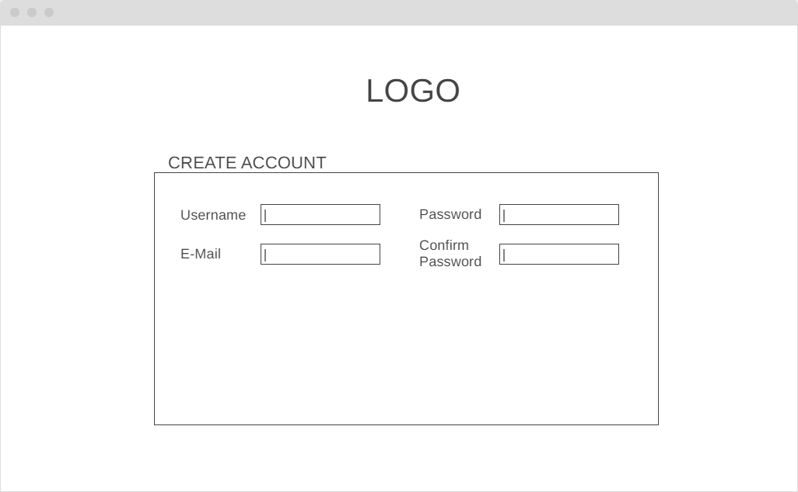
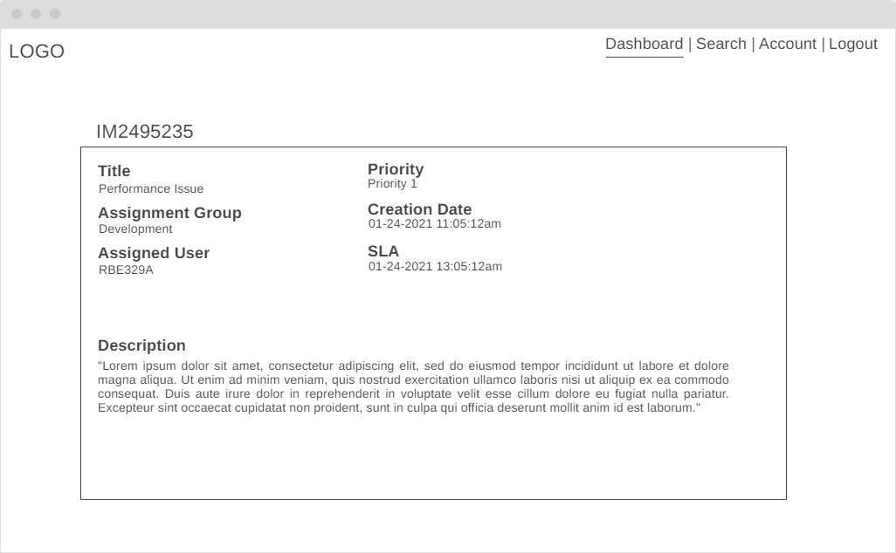

# Bug Tracker
This project is about designing and developing a basic bug tracker tool for programmers.
The program will be created for educational use only.

## Technologies
- [Python 3.0](https://www.python.org/)
- [Flask 1.1](https://flask.palletsprojects.com/en/1.1.x/)
- [MongoDB](https://www.mongodb.com/3)

## User Stories
- As a User, I want to be able to register, update and delete a client account.
- As a User, I want the ability to create, update and delete my own incidents.
- As a User, I want to have a dashboard that includes all incidents created by myself and others.
- As a User, I want to have a search function to easily find other incidents.
- As a User, I want to be able to monitor incidents organized according to certain categories.
- As a User, I want a site that is fast, responsive across devices and easy to use.

## Wireframes

